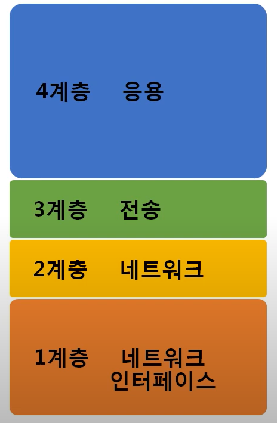
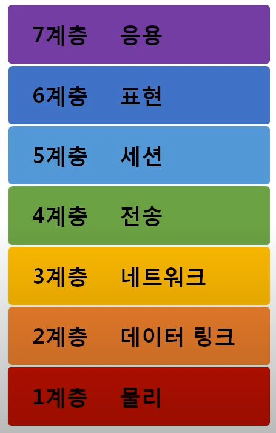
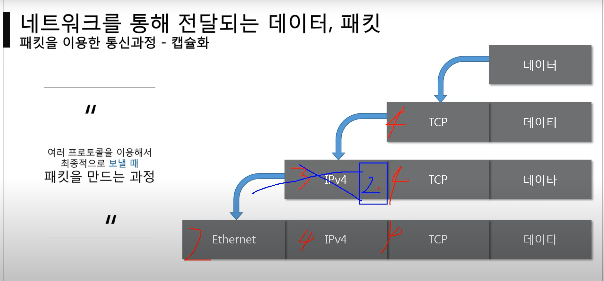
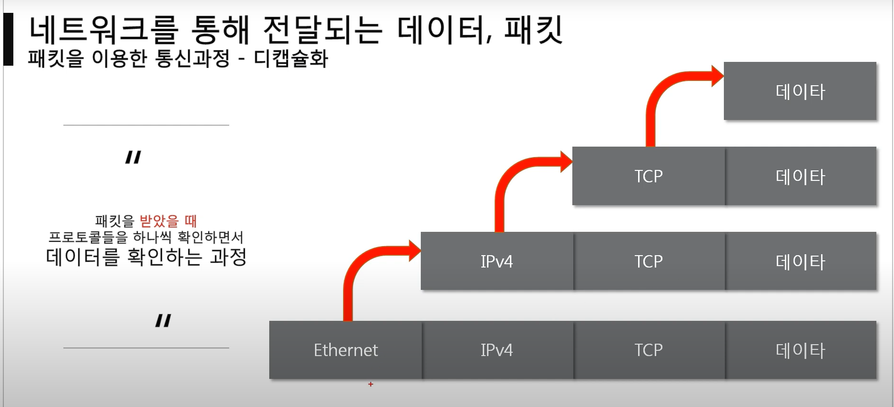

전체영상: [네트워크 기초(개정판)](https://www.youtube.com/playlist?list=PL0d8NnikouEWcF1jJueLdjRIC4HsUlULi)

### [네트워크란?](https://youtu.be/Av9UFzl_wis?list=PL0d8NnikouEWcF1jJueLdjRIC4HsUlULi)

1. 네트워크란?

   - 노드들이 데이터를 공유할 수 있게 하는 디지털 전기 통신망의 하나. 즉 분산되어 있는 컴퓨터를 통신망으로 연결한 것

2. 네트워크의 분류
   크기에 따른 분류로는

   - LAN(Local Area Network): 가까운 지역을 하나로 묶은 네트워크
   - WAN(Wide Atrea Network): 멀리 있는 지역을 한데묶은 네트워크로 LAN과 LAN을 다시 하나로 묶은것이라고 보면됨.
   - MAN(Metropolitan Area Network), VLAN, CAN, PAN 등등

   연결 형태에 따른 분류

   - Star형 : 중앙 장비에 모든 노드가 연결(ex: 공유기를 통해 핸드폰, 컴퓨터 티비 등이 연결되는 것)
   - Mesh형 : 여러 노드들이 서로 그물처럼 연결(멀리 떨어져 있는 대역을 연결하는 방식으로 사용)
   - Tree형 : 나무의 가지처럼 계증 구조로 연결
   - 링형, 버스형, 혼합형 등

- 네트워크의 통신 방식

  - 유니 캐스트 : 특정 대상이랑만 1:1로 통신하는 방식(특정한 한명)
  - 멀티 캐스트 : 특정 다수와 1:N으로 통신하는 방식(특정한 다수)
  - 브로드 캐스트 : 네트워크에 있는 모든 대상과 통신하는 방식(무분별 다수)

- 네트워크 프로토콜 : 일종의 약속, 양식으로 네트워크에서 노드와 노드가 텅신할 때 어떤 노드가 어느 노드에게 어떤 데이터를 어떻게 보내는지 작성하기 위한 양식을 뜻함.
  - 가까운곳이랑 연락할 때 : Ethernet 프로토콜 (MAC주소)
  - 멀리 있는 곳과 연락할 때 : ICMP, IPv4, ARP (IP주소)
  - 여러가지 프로그램으로 연락할때 : TCP, UDP (포트 번호)
    이러한 여러 프로토콜들을 같이 합께 사용할때는 갭슐화 된 패킷으로 사용

### [실습1 (tracert)](https://youtu.be/paJf7JbBWqY?list=PL0d8NnikouEWcF1jJueLdjRIC4HsUlULi)

-

### [실습2 (Wireshark)](https://youtu.be/vBrQ3yzerMg?list=PL0d8NnikouEWcF1jJueLdjRIC4HsUlULi)

-

### [네트워크 모델](https://youtu.be/y9nlT52SAcg?list=PL0d8NnikouEWcF1jJueLdjRIC4HsUlULi)

1. 네트워크 모델의 종류

   - TCP/IP 모델 : 현재의 인터넷에서 컴퓨터들이 서로 정보를 주고받는데 쓰이는 프로토콜의 모음
     1계층)네트워크 인터페이스 => 네트워크 => 전송 => 4계층)응용
     

   - OSI 7 계층 : 1984년 네트워크 통신을 체계적으로 다루는 ISO에서 표준으로 지정한 모델
     1계층) 물리 => 데이터 링크(이더넷) => 네트워크(IP, ICMP, ARP) => 전송(TCP, UDP) => 세션 => 표현 => 7계층) 응용(HTTP)
     

2. 두 모델의 공통점과 차이점

   - 공통점 : 계층적 네트워크 모델, 계층간 역할 정의
   - 차이점 :
     계층의 수 차이
     OSI는 역할기반, TCP/IP는 프로토콜 기반 (OSI는 말로만 하는 개념느낌이고, 실질적으로는 TCP/IP랑 가까움)
     OSI는 통신 전반에 대한 표준, TCP/IP는 데이터 전송기술 특화

3. 네트워크를 통해 전달되는 데이터, 패킷
   - 패킷이란 네트워크 상에서 전달되는 데이터를 통칭하는 말로 네트워크에서 전달하는 데이터의 형식화된 블록임.
   - 패킷의 형태 : 헤더 | 페이로드(사용자 정보) | 풋터
   - 인캡슐 레이션(패킷을 싸서 보내는 과정) : 상위 계층에서 하위계층으로 가면서 번호가 붙음
     
   - 디캡슐화(받은 데이터를 확인하는 과정) :
     
   - 계층별 패킷의 이름 : 몇개층까지 붙었는지에 따라 패킷의 이름이 다름
     4계층까지 : 세그먼트 / 3계층까지 : 패킷 / 2계층까지 : 프레임
