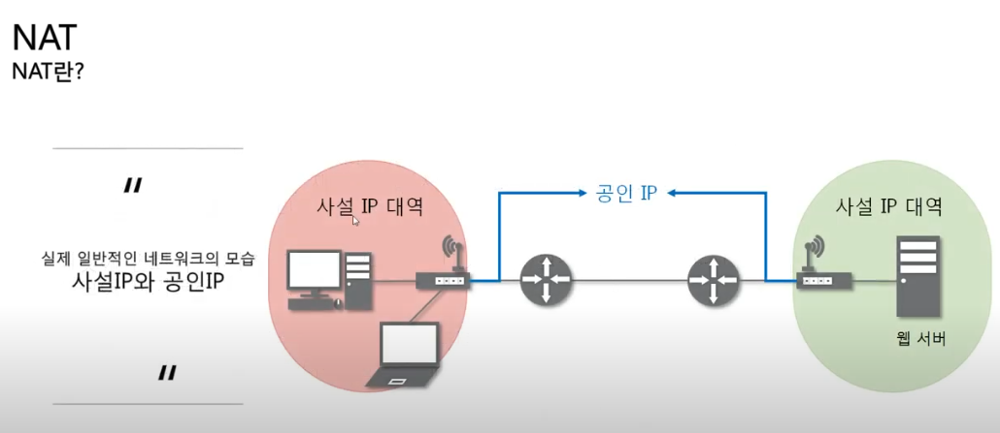
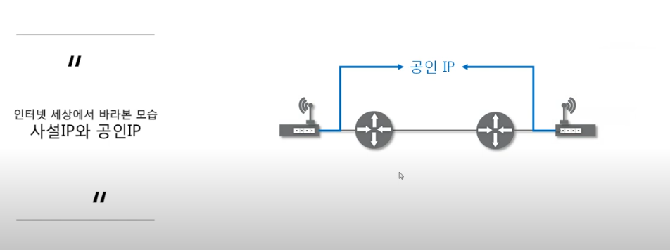
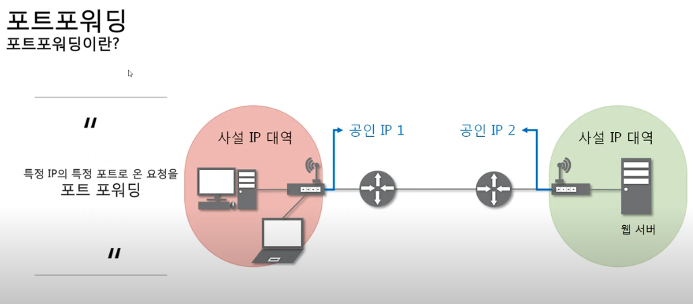
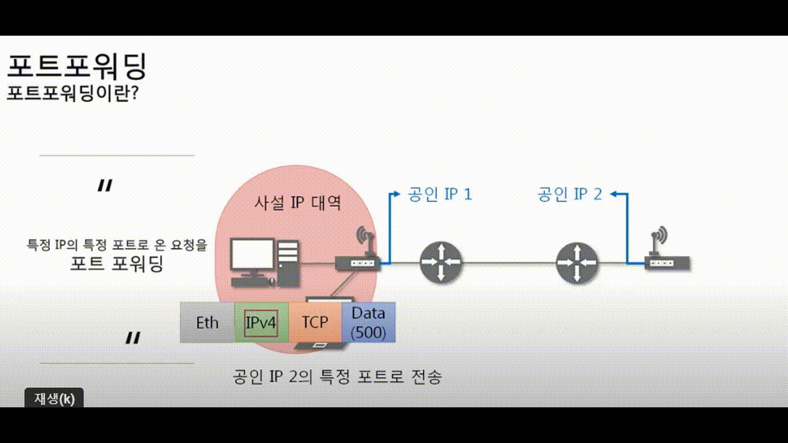

## [NAT란?](https://youtu.be/Qle5cfCcuEY?list=PL0d8NnikouEWcF1jJueLdjRIC4HsUlULi)

- IP 패킷의 TCP/UDP 포트 숫자와 소스 및
  목적지의 IP주소 등을 재기록 하면서 라우터를 통해 네트워크 트래픽을 주고받는
  기술

- NAT가 3,4계층 까지도 직접 만드는거 대신에 자기가 다시 만들었다고
  NAT테이블에 기록함

- 특정 포트번호로 가는 패킷을 다른 IP주소에 다른 PORT번호로 바꿔주는거
  원래 갈려고 했던 곳이 있었으면 다른곳으로 가라 하는거

- 패킷에 변화가 생기기 때문에 IP나 TCP/UDP의 체크섬(checksum)도 다시 계산되어 재기록해야 한다.

### NAT를 이용하는 이유

- 대개 사설 네트워크에 속한 여러 개의 호스트가 하나의 공인 IP주소를 사용하여 인터넷에 접속하기 위함

- 하지만 꼭 사설IP를 공인IP로 변환하는 데에만 사용하는 기술은 아니다.

## 포트 포워딩(포트 매핑)

- 패킷이 라우터나 방화벽과 같은 네트워크 장비를 가로지르는 동안 특정 IP 주소와 포트 번호의 통신 요청을 특정 다른 IP와 포트 번호로 넘겨주는 네트워크 주소 변환(NAT)의 응용이다.

- 이 기법은 게이트웨이(외부망)의 반대쪽에 위치한 사설네트워크에 상주하는 호스트에 대한 서비스를 생성하기 위해 흔히 사용된다.

- 직접 그 컴퓨터에 IP를 치는게 아니라 공인IP로 보낸다
  공유기에 포트포워딩 설정을 해놔야한다.

- 보내고 나면 공유기가 특정 포트로 들어온 요청을 다른 특정IP의 특정
  포트로 전송한다.

### [포트 포워딩 설정 실습](https://youtu.be/EvYI14QdM6A?list=PL0d8NnikouEWcF1jJueLdjRIC4HsUlULi)

- http://192.168.0.1/ 들어가서 NAT/라우터 설정
- 외부 포트와 내부 포트 설정
