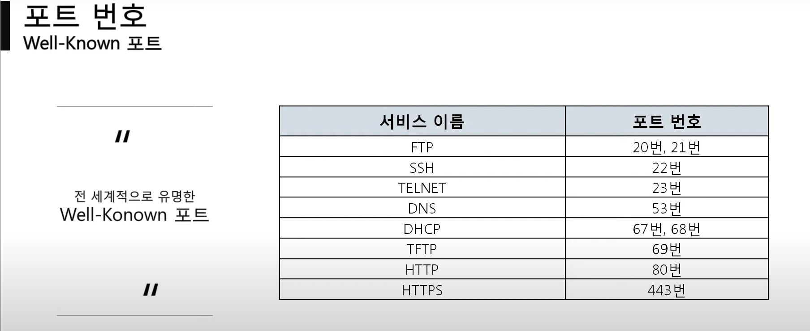
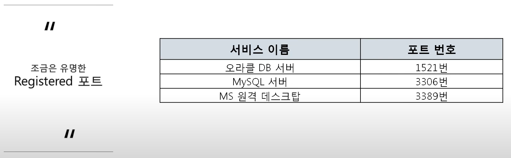
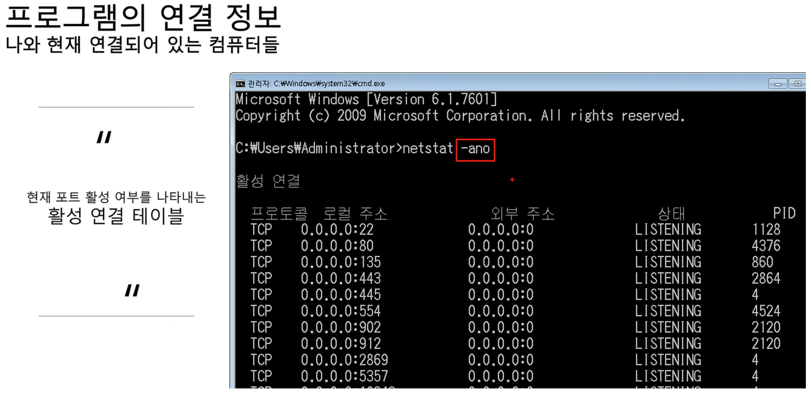
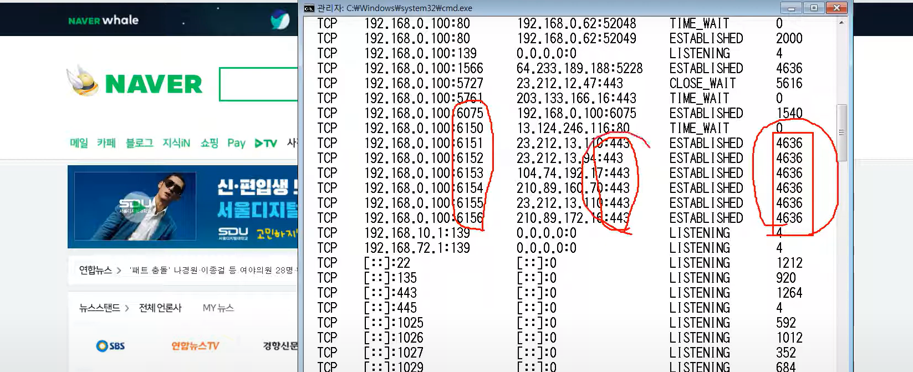

### [4계층 프로토콜](https://youtu.be/tG0ldt4sBzY?list=PL0d8NnikouEWcF1jJueLdjRIC4HsUlULi)

- 4계층에서 하는 일
  - 송신자의 프로세스와 수신자의 프로세스를 연결하는 통신 서비스 쉽게 말하면 내 컴퓨터의 카톡이 상대 컴퓨터의 네이트온 이나 다음같은 다른 프로그램이 아닌 같은 프로그램인 카톡과 이어지는것
- 4계층 프로토콜의 종류
  - 연결 지향 전송 방식인 TCP 프로토콜 => 잘받았는지 확인 후 다음거 보내던가 다시보내기를 시도 즉 안전한 연결 지향
  - 비연결 지향형 UDP 프로토콜 => 연결을 하던말든 데이터를 던짐 즉 안전하지 않은 연결을 지향

### 포트 번호

- 포트번호의 특징
  - 특정프로세스와 특정 프로세스가 통신을 하기 위해 사용하는 번호로 하나의 포트는 하나의 프로세스만 사용 가능
  - 포트 번호는 일반적으로 정해져 있지만 무조건 지켜야 하는것은 아님 예를들어 웹 서비스는 80번 포트를 일반적으로 사용하지만 항상 80번 포트를 사용해야만 하는것이 아님
- Well-Know포트(중요)
  
- Registered 포트
  
- Dynamic 포트
  49152번 ~ 65535번

### [포트 연결 확인 실습](https://youtu.be/Jb7tCFp-udM?list=PL0d8NnikouEWcF1jJueLdjRIC4HsUlULi)

- 프로그램의 연결 정보 => 네이버 들어가면서 동시에 cmd창에 빠르게 치면 연결되는 정보 확인 가능

  - 관리자(CMD) 를 열어서 -ano로 연결정보 확인 가능
    

  - 왼쪽부터 네이버의 6075번 프로그램이랑 연결 / 네이버의 443번 포트랑 연결 / 나의 4636프로그램이랑 연결됨(내 프로그램) => 보통은 크롬 또는 엣지같은 프로그램의 PID번호가 나옴
    

### [특정 포트 사용 실습](https://youtu.be/Qqmwm3rFihk?list=PL0d8NnikouEWcF1jJueLdjRIC4HsUlULi)

- WebShare라는 프로그램으로 서버를 하나 실행시킬 수 있는 실습.
