### [ TCP 프로토콜](https://www.youtube.com/watch?v=cOK_f9_k_O0&list=PL0d8NnikouEWcF1jJueLdjRIC4HsUlULi&index=21)

- 전송 제어 프로토콜(Transmission Control Protocol, TCP)은 인터넷에 연결된 컴퓨터에서 실행되는 프로그램 간에 통신을 안정적으로, 순서대로, 에러없이 교환할 수 있게 한다.
- TCP는 UDP보다 안전하지만 느리다 (체감은 어려움)
- 안정성을 필요로 하지 않는 애플리케이션의 경우 일반적으로 TCP 대신 UDP를 사용함
- 상대방에게 연결 상태를 계속 물어보는 특징이 있음
  
  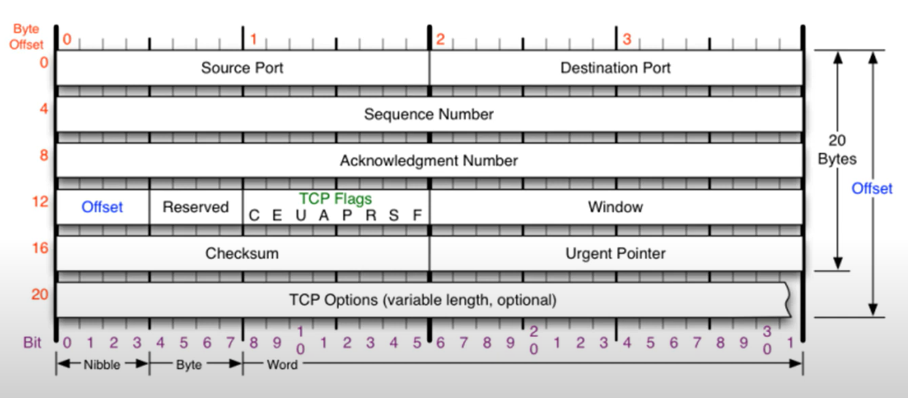
  
- Offset: 헤더의 길이를 의미
- Reserved: 예약된 필드, 사용하지 않음
- Window: 남아있는 TCP 버퍼 공간이 얼마나 있는지 정보를 담음 (요청 보내는 측에게 어느 정도 크기의 데이터 보내도 되는지 알려줌)

### [ TCP 플래그 (중요)](https://www.youtube.com/watch?v=Ah4-MWISel8&list=PL0d8NnikouEWcF1jJueLdjRIC4HsUlULi&index=22)

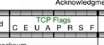

U A P R S F 만 알면 된다

- 플래그 => 연결 상태, 응답 메시지 등을 나타냄

- U : urgent flag, 지금 보내는 메시지에 우선순위가 높은 메시지가 담겨 있다는 표시, 이 자리가 1이면 급하다는 의미

  - Urgent Pointer랑 같이 쓰임

- A : ack flag, 승인 비트

  - OK, 보내도 됨~

- P : 밀어넣기 비트, TCP 버퍼가 일정 크기만큼 쌓여야 전송하는데 상관없이 데이터를 밀어넣겠다는 의미 (많이 사용X)

- R : reset 비트, 상대방과 연결이 되어있는 상태에서 연결 관계를 초기화하자는 의미

- S : sync 비트, 동기화 비트, 상대방과 연결을 시작할 때 무조건 사용하는 플래그, 서로 상태를 동기화시키는 용도

- F : finish 비트, 연결을 끝내는 비트

- TCP 플래그 예시
  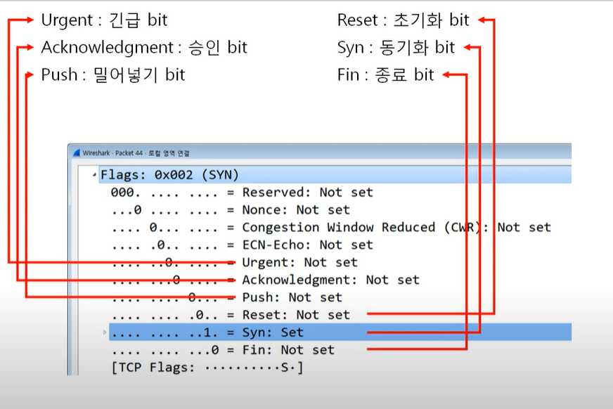

### [TCP 3Way Handshake](https://www.youtube.com/watch?v=0vBR666GZ5o&list=PL0d8NnikouEWcF1jJueLdjRIC4HsUlULi&index=23)

(웹 통신, 파일 전송, 게임 => 모두 TCP 통신)
둘 사이 연결을 수립하는 과정
TCP를 이용한 데이터 통신을 할 때 프로세스와 프로세스를 연결하기 위해 가장 먼저 수행되는 과정

1. 클라이언트가 서버에게 요청 패킷을 보냄
2. 서버가 클라이언트의 요청을 받아들이는 패킷을 보냄
3. 클라이언트는 이를 최종적으로 수락하는 패킷을 보냄
   => 3Way Handshake
   
   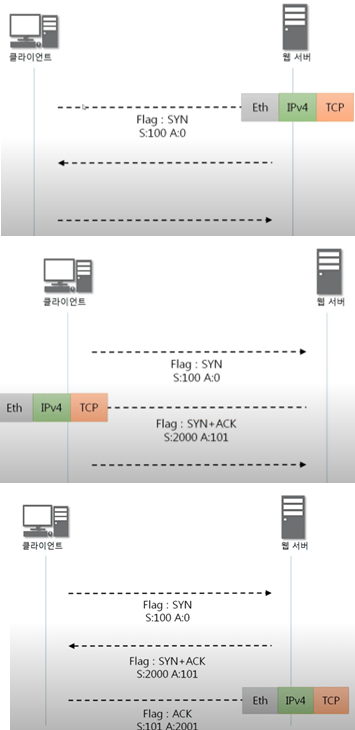

- 각 단계에서 SYN, ACK 플래그 숫자 규칙
  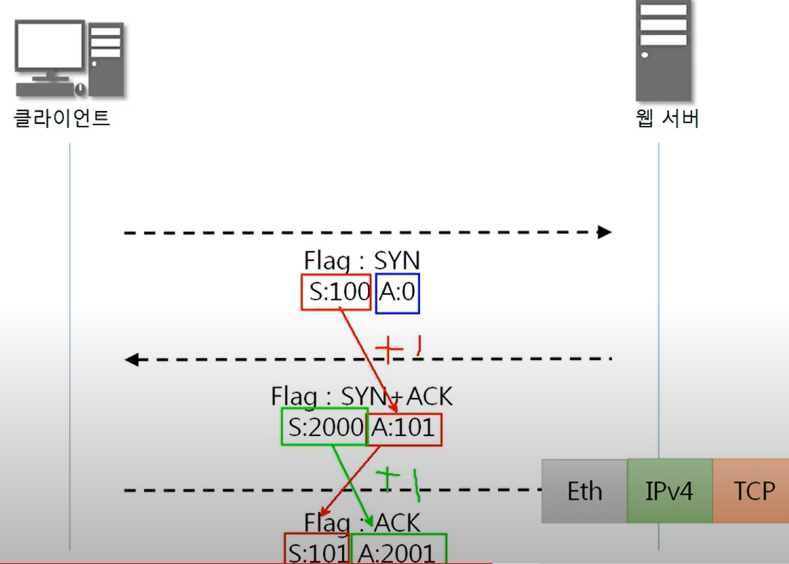

  - 처음에 S: 랜덤값, A: 0 - 두번째 S: 랜덤값, A: 이전 S값 + 1 - 세번째 S: 이전 A, A: 이전 S값 + 1

### [TCP를 이용한 데이터 전송 과정](https://www.youtube.com/watch?v=0vBR666GZ5o&list=PL0d8NnikouEWcF1jJueLdjRIC4HsUlULi&index=23)

3Way handshake를 해서 연결이 된 후,
페이로드(데이터)를 포함한 패킷을 주고 받는 경우

1. 보낸 쪽에서 또 보낼 때(클라이언트의 요청)는 SYN 번호, ACK 번호가 그대로
2. 받는 쪽(웹 서버)에서 SYC 번호는 받은 ACK 번호가 된다
3. 받는 쪽(웹 서버)에서 ACK 번호는 **받은 SYC 번호 + 데이터 크기**

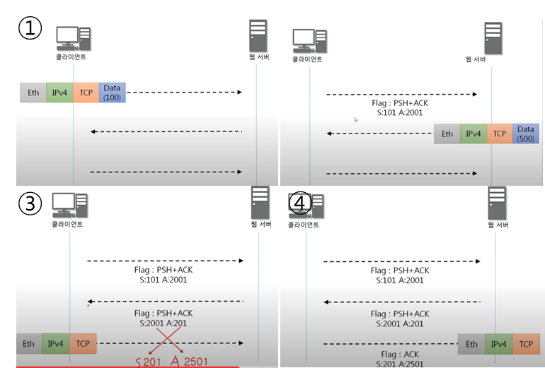

### [TCP의 연결 상태 변화](https://www.youtube.com/watch?v=yY0uQf0BTH8&list=PL0d8NnikouEWcF1jJueLdjRIC4HsUlULi&index=24)

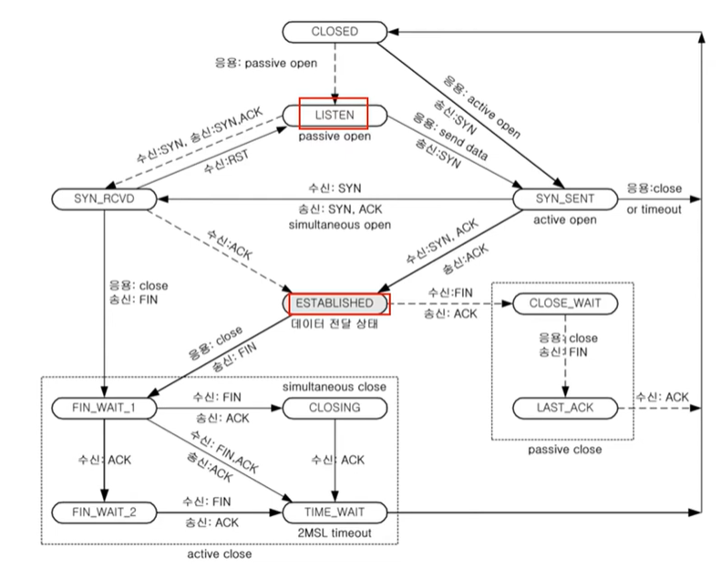

이 중에서 LISTEN, ESTABLISHED만 중요

- LISTEN : 포트 번호를 열어놓고 있는 상태 (서버 쪽에서 프로그램이 사용하고 있는 상태), 클라이언트의 요청을 계속 듣고 있는 상태
- ESTABLISHED : 연결이 수립된 상태 (3way handshake 끝나면)

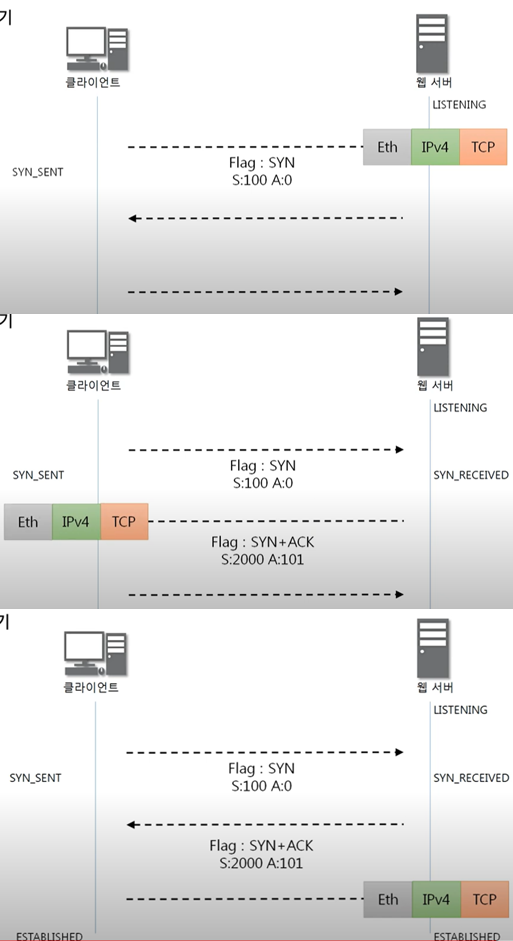

### [TCP 프로토콜 분석 실습](https://www.youtube.com/watch?v=WseqBDo-j3Y&list=PL0d8NnikouEWcF1jJueLdjRIC4HsUlULi&index=25&pp=iAQB)

1. wireshark를 연다
2. 현재 통신하고 있는 것을 클릭한다 (ex: Wi-Fi)
   
   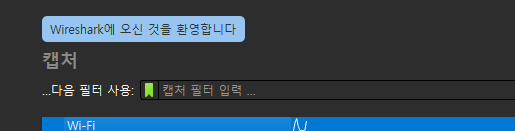
   
3. 상단 필터에 tcp를 검색한다
4. 인터넷으로 어딘가 들어가본다, 상단에서 (패킷 캡쳐 정지)를 클릭한다.
5. 아래와 비슷한거 찾는다
   
   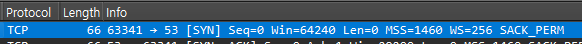
6. 우클릭, 따라가기 > TCP 스트림 클릭한다 => 통신 흐름이 쭉 나옴
7. 상단바에서 통계 > 플로 그래프를 클릭한다 (표시 필터로 제한 클릭)
8. 수업 자료와 같은 TCP 통신 플로우를 확인할 수 있다
   (처음 3way handshake => 데이터 주고 받음)
   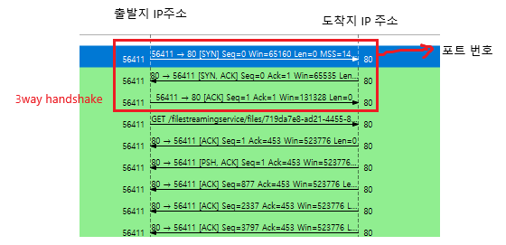
