영상: [운영체제](http://www.kocw.net/home/search/kemView.do?kemId=1046323)

## [1 운영체제 개요](https://core.ewha.ac.kr/publicview/C0101020140307151724641842?vmode=f)

### 운영 체제란?

- 사용자 및 다른 모든 소프트웨어와 하드웨어를 연결하는 소프트웨어 계충

- 좁은 의미로의 운영체제(커널) : 부팅이후 메모리에 항상 상주하고 있는것을 운영체제의 커널이라고 부름
- 넓은 의미로의 운영체제 : 커널 뿐 아니라 주변의 각종 주변 시스템 유틸리티를 포함한 개념

### 운영 체체의 목적

- CPU, 메모리, 각종 입출력 장치등의 자원(리로스)을 효율적으로 관리하는것이 주 목적 즉 주어진 자원으로 최대한의 성능을 내도록 하기 위함

- 사용자에게 편리하게 컴퓨터를 사용할 수 있도록 해주기 위함 예를들어 하드웨어를 직접 다르는 복잡한 부분을 운영체제가 대행한다고 보면 된다.

### 운영 체제의 분류

- 동시 작업 가능 여부에 따른 분류
    1. 단일 작업 : 한번에 하나의 작업만 처리 MS-DOS등이 있음
    2. 다중 작업 : 동시에 두개이상의 작업 처리 UNIX, MS Windows등이 있음

- 사용자의 수에 따른 분류
    1. 단일 사용자 : MS-DOS, MS Windows 가 있음
    2. 다중 사용자 : UNIX, NT server 가 있음

- 처리 방식에 따른 분류
    1. 일괄 처리 : batch processing이라고도 하며, 작업 요청의 일정량을 모아서 한꺼번에 처리하고 작업이 완전 종료될 떄까지 기다려야 함

    2. 시분할 : Time sharing이라고 하며, 여러 작업을 수행할 때 컴퓨터 처리 능력을 일정한 시간 단위로 분할하여 사용하고 일괄 처리 시스템에 비해 짧은 응답 시간을 가졌다. interactive한 방식

    3. 실시간 : Realtime OS 라고 하며, 정해진 시간안에 어떠한 일이 반드시 종료됨이 보장되어야 하는 실시간시스템을 위한 OS로 원자로/공장 제어, 미사일 제어, 반도체 장비, 로보트 제어 등의 정확한 시간에 맞춰야 할때 씀

### 몇 가지 용어

- Multitasking : 여러가지 작업이 동시에 되는것
- Multiprogramming : 여러 프로그램이 메모리에 올라가 있음을 강조
- Time sharing : 멀티태스킹과 유사한 용어지만 CPU의 시간을 분할하여 나누어 쓴다는 의미를 강조
- Multiprocess : 하나의 컴퓨터에 CPU가 여러 개 붙어 있음을 의미

### 운영 체제의 예

- 유닉스(UNIX) : 
    1. 코드의 대부분을 C로 사용
    2. 높은 이식성
    3. 최소한의 커널 구조
    4. 복잡한 시스템에 맞게 확장 용이
    5. 소스 코드 공개
    6. 프로그램 개발에 용이
    7. 다양한 버전이 있음 (freeBSD, SunOS, Solaris, Linux)

- DOS(Disk Operating System) :
    1. MS사에서 1981년 IBM-PC를 위해 개발
    2. 단일 사용자용 운영체제, 메모리 관리 능력의 한계(640KB)

-  MS Windows :
    1. MS 사의 다중 작업용 GUI 기반 운영 체제
    2. Plug and Play, 네트워크 환경 강화
    3. DOS용 응용 프로그램과 호환성 제공
    4. 불안정성
    5. 풍부한 지원 소프트웨어

- Handheld device를 위한 OS :
    1. PalmOS, Pocket PC, Tiny Os

### 운영 체제의 구조

## [2 시스템 구조 및 프로그램의 실행 Part-1](https://core.ewha.ac.kr/publicview/C0101020140311132925816476?vmode=f)

하드웨어 동작 부분이다.

### 컴퓨터 시스템 구조
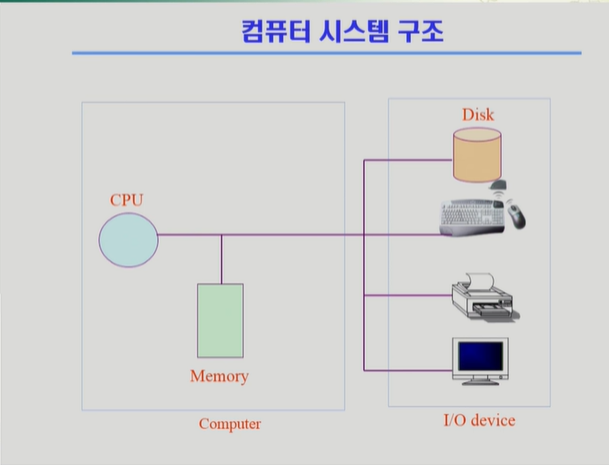
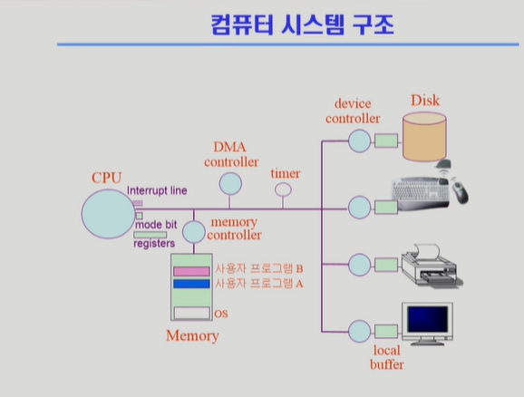
- cpu: 매 클락마다 메모리에서 기계어를 읽어서 실행, 메모리 접근만 함
- 메모리: cpu의 작업공간
- 디바이스 컨트롤러: 디스크 내부 통제 등 디바이스를 통제하는 작은 cpu역할을 함
- 로컬 버퍼: 디바이스 컨트롤러 작업공간
- mode bit: cpu실행프로그램 구분
- 레지스터: cpu안의 저장공간, 속도 빠름
- interrupt line: 
- 타이머: 특정 프로그램이 cpu를 독점하는 것 방지. 일정 시간이 지나면 사용자프로그램이 cpu 제어권을 운영체제로 넘겨주도록.

- 사용자프로그램은 io장치에 직접 접근불가

- DMA controller: direct memory access, cpu 인터럽트는 오버헤드가 크기때문에 얘가 로컬버퍼에 들어오는 내용이 작업이 끝났으면 메모리에 복사하는 역할까지 하는거. cpu를 효율적으로 쓰기 위해
- memory controller: 교통정리

### Mode bit
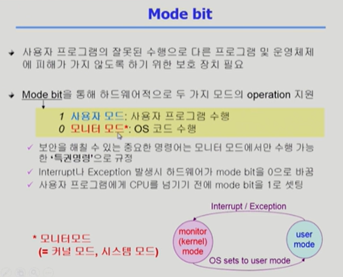
- 커널모드(모니터모드): os가 cpu에서 실행중, 무슨 일이든지 가능
- 사용자모드: 제한된 인스트럭션(일반명령)만 가능, 보안측면

### Timer

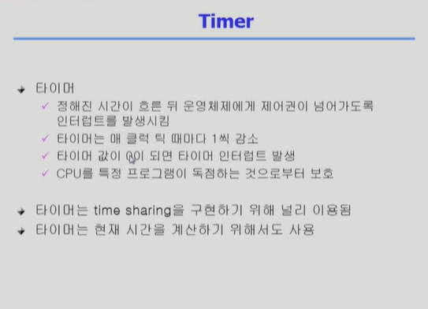

### Device Controller

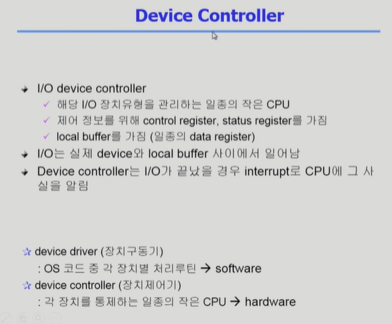

### [입출력과 인터럽트 (Input-Output and Interrupt)](/컴퓨터-구조/5장-기본-컴퓨터의-구조와-설계-Part2/입출력과-인터럽트.md)

### 시스템 콜 (System Call)
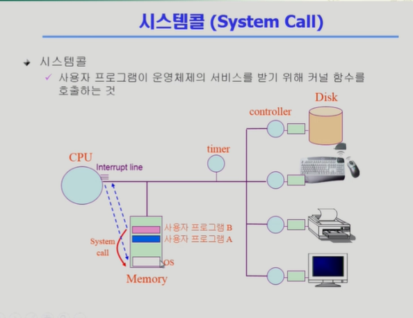
- 사용자프로그램이 운영체제의 함수(커널)를 호출하는 것
- 직접 메모리 점프 불가능하기 때문에 소프트웨어가 인터럽트 라인을 세팅함

## [2 시스템 구조 및 프로그램의 실행 Part-2](https://core.ewha.ac.kr/publicview/C0101020140314151238067290?vmode=f)

### 동기식 입출력과 비동기식 입출력

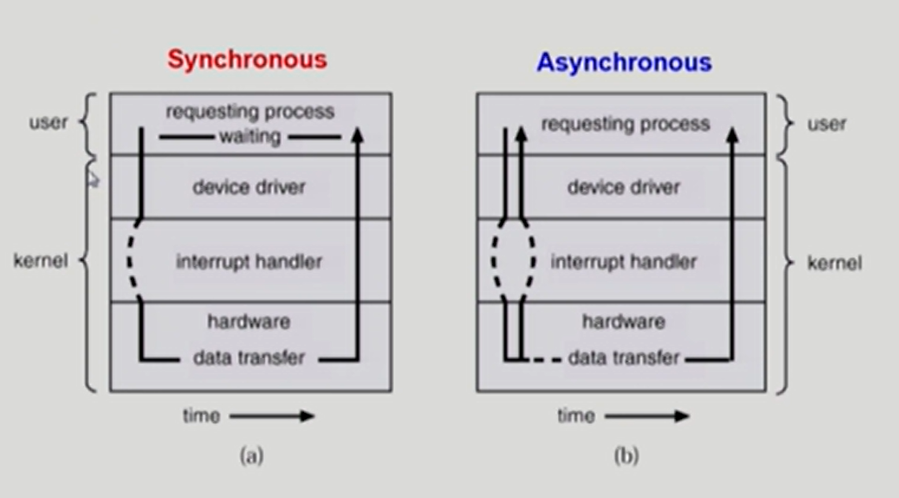

- 동기식 입출력 (synchronous I/O)
	- I/O 요청 후 입출력 작업이 완료된 후에야 제어가 사용자 프로그램에 넘어감
    - 구현 방법 1
    	- I/O가 끝날 때까지 CPU를 낭비시킴
        - 매시점 하나의 I/O만 일어날 수 있음
     - 구현 방법 2
     	- I/O가 완료될 때까지 해당 프로그램에게서 CPU를 뺴앗음
        - I/O 처리를 기다리는 줄에 그 프로그램을 줄 세움
        - 다른 프로그램에서 CPU를 줌
        
- 비동기식 입출력 (asynchronous I/O)
	- I/O가 시작된 후 입출력 작업이 끝나기를 기다리지 않고 제어가 사용자 프로그램에 즉시 넘어감
    
=> 두 경우 모두 I/O의 완료는 인터럽트로 알려줌

### DMA (Direct Memory Access)
- 빠른 입출력 장치를 메모리에 가까운 속도로 처리하기 위해 사용
- CPU의 중재 없이 device controller가 device의 buffer storage의 내용을 메모리에 block 단위로 직접 전송
- 바이트 단위가 아니라 block 단위로 인터럽트를 발생시킴
- 
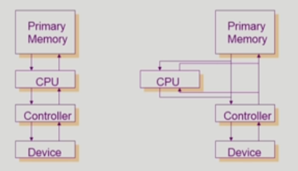

### 서로 다른 입출력 명령어
- I/O를 수행하는 **special instruction**에 의해 (일반적인 방식) : memory instruction 따로, I/O 장치 instruction 따로
- **Memory Mapped I/O**에 의해 : memory 주소에 연장 주소(device I/O를 가리킴)를 붙임

### 저장장치 계층 구조

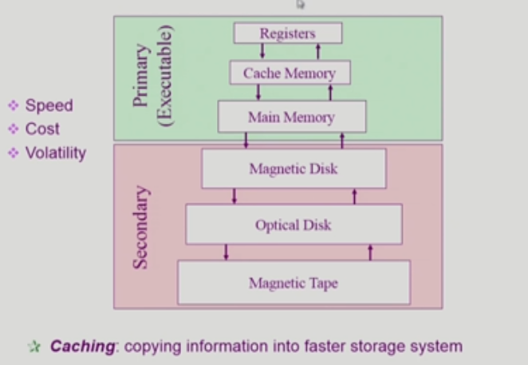

Registers > Cache Memory(SRAM) > Main Memory(DRAM) > Magnetic Disk > Optical Disk > Magnetic Tape
왼쪽을 갈수록, 속도가 빠르고 가격이 비싸고 용량이 적다 

Primary => 휘발성, CPU에서 직접 접근 가능(바이트 단위로 접근 가능해야함) => 실행 가능
Secondary => 비휘발성, CPU에서 직접 접근 불가능(섹터 단위로 접근) => 실행 불가능

### 프로그램의 실행 (메모리 load)

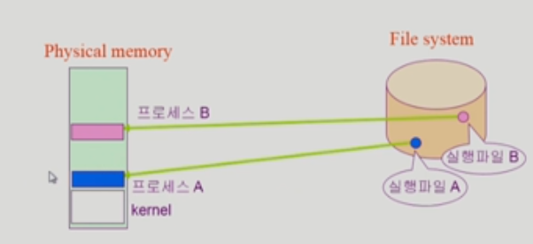

=> 실제로는 

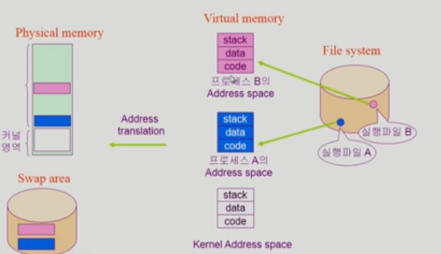

- File System: 비휘발성 저장공간
- 프로그램은 File System에 실행 파일 형태로 저장되어 있고, 이를 실행하면 메모리에 올라가 프로세스가 된다. 정확히 말하면, 물리적인 메모리에 프로그램이 바로 올라가는 것이 아니라 가상 메모리 단계를 추가로 거친다. 이때 독자적인 메모리 주소 공간이 형성되는데, 이 공간에는 Code, Data, Stack 영역이 있다.

Code: CPU에서 실행할 기계어 코드를 저장한다.
Data: 전역 변수 등 프로그램이 사용하는 데이터를 저장한다.
Stack: 함수가 호출될 때 호출된 함수의 수행을 마치고 복귀할 주소 및 데이터를 임시로 저장한다.

그 다음 가상 메모리에서 물리적인 메모리로 프로그램이 올라가는데, 메모리 낭비를 방지하기 위해 프로그램 중 당장 실행에 필요한 부분만 올라가고, 그렇지 않은 부분은 디스크 중 메모리의 연장 공간으로 사용되는 스왑 영역에 내려 놓는다. 즉, 주소 공간을 쪼개서 어떤 부분은 메모리에 있고, 어떤 부분은 스왑 영역에 있게 된다.

 
### 커널 주소 공간의 내용

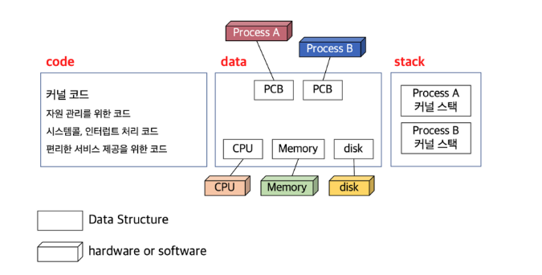

### 사용자 프로그램이 사용하는 함수
- 사용자 정의 함수:
자신의 프로그램에서 정의한 함수

- 라이브러리 함수:
자신의 프로그램에서 정의하지 않고 가져다 사용한 함수
자신의 프로그램 실행 파일에 포함되어 있다.

=> 위의 두 개는 프로그램 내에서 실행됨, 유저 모드에서 동작

- 커널 함수:
운영 체제 프로그램의 함수
커널 함수의 호출 = 시스템 콜
당연하지만, 주소 점프를 할 수 없으므로 인터럽트 라인을 세팅하여 CPU에게 제어권을 넘겨야 한다.
=> 시스템 콜, 커널 모드에서 동작
