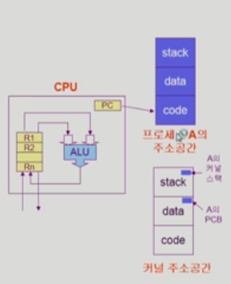
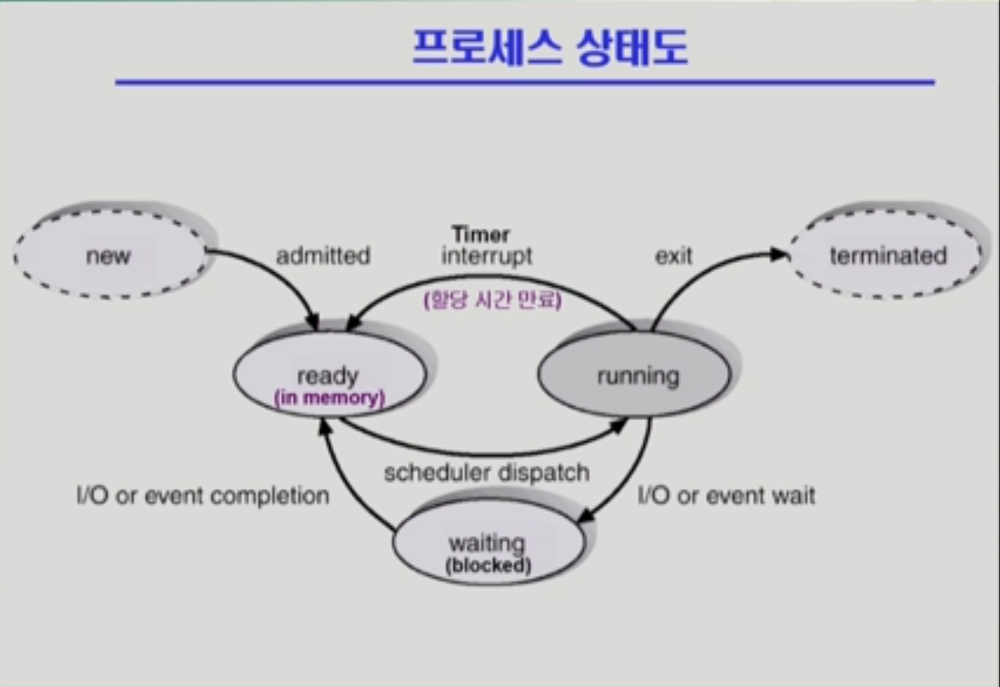
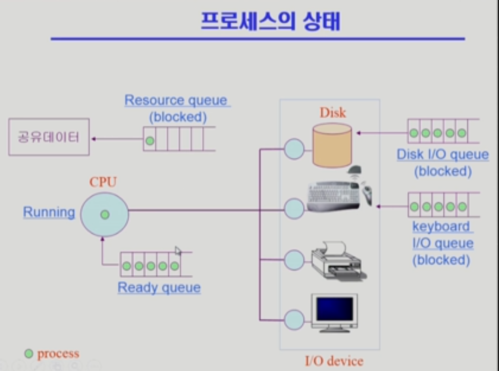
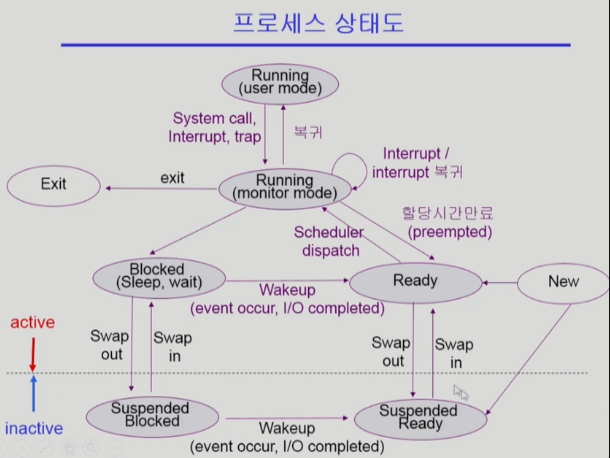
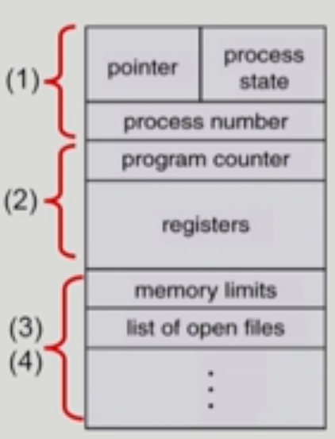
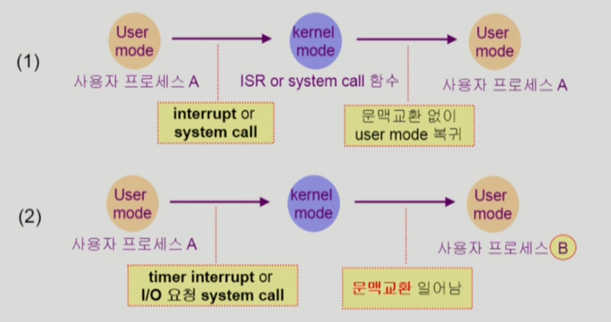
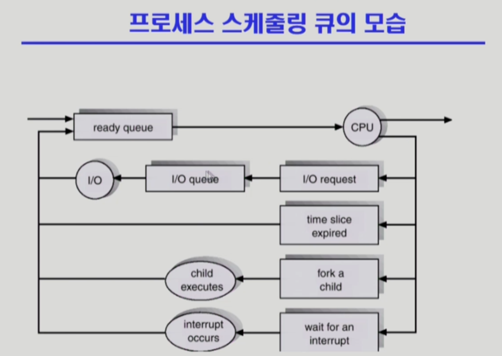

## [프로세스 #1](https://core.ewha.ac.kr/publicview/C0101020140318134023355997?vmode=f)

### 프로세스의 개념

- "Process is a program in execution(실행중에 있는 프로그램)"

- 프로세스의 문맥(context)
- **프로세스의 문맥 파악이 중요하다**
  - CPU 수행 상태를 나타내는 하드웨어 문맥
    - Program Counter
    - 각종 register
  - 프로세스의 주소 공간
    - code, data, stack
  - 프로세스 관련 커널 자료 구조
    - PCB(Process Control Block)
    - Kernel stack (시키는거)

### 프로세스의 상태 (Process State)

- 프로세스의 상태(state)가 변경되며 수행된다.

  - Running

    - CPU를 잡고 instruction을 수행중인 상태

  - Ready

    - CPU를 기다리는 상태(메모리 등 다른 조건을 모두 만족하고)

  - Blocked (wait, sleep)

    - CPU를 주어도 당장 instruction을 수행할 수 없는 상태
    - Process 자신이 요청한 event가 즉시 만족되지 않아 이를 기다리는 상태
    - 디스크에서 file을 읽어와야 하는 경우

  - Suspended (stopped)
    - 외부적인 이유로 프로세스의 수행이 정지된 상태
    - 프로세스는 통째로 디스크에 swap out 된다.
    - (예) 사용자가 프로그램을 일시 정지시킨 경우 (break key) 시스템이 여러 이유로 프로세스를 잠시 중단 시킴(메모리에 너무 많은 프로세스가 올라와 있을 때)

- 이 두가지 구분하는게 좋음
- Blocked:자신이 요청한 event가 만족되면 Ready
- Suspended: 외부에서 resume해 주어야 Active

- 아래 2가지는 경우에 따라 포함 안시키는 경우도 있다.

  - New: 프로세스가 생성중인 상태
  - Terminated: 수행(execution)이 끝난 상태

### Process Control Block(PCB)

- 운영체제가 각 프로세스를 관리하기 위해 프로세스당 유지하는 정보
- 다음의 구성요소를 가진다(구조체로 유지)

  1. OS가 관리상 사용하는 정보

     - Process statem Process ID
     - scheduling information, priority

  2. CPU 수행 관련 하드웨어 값

     - Program counter, registers

  3. 메모리 관련

     - Code, data, stack 의 위치 정보

  4. 파일 관련

     - Open file descriptors...

  

### 문맥 교환 (Context Switch)

**중요**

- CPU를 한 프로세스에서 다른 프로세스로 넘겨주는 과정

- CPU가 다른 프로세스에게 넘어갈 때 운영체제는 다음을 수행

  - CPU를 내어주는 프로세스의 상태를 그 프로세스의 PCB에 저장
  - CPU를 새롭게 얻는 프로세스의 상태를 PCB에서 읽어옴

- System call 이나 Interrupt 발생시 반드시 context switch가 일어나는 것은 아님

  

- (1)의 경우에도 CPU 수행 정보 등 context의 일부르르 PCB에 save해야 하지만 문맥교환을 하는 (2)의 경우 그 부담이 훨씬 큼 (eg. cache memory flush)

### 프로세스를 스케줄링하기 위한 큐

- Job queue

  - 현재 시스템 내에 있는 모든 프로세스의 집합

- Ready queue

  - 현재 메모리 내에 있으면서 CPU를 잡아서 실행되기를 기다리는 프로세스의 집합 (PCB를 줄세운 거라 생각하면 된다.)

- Device queues

  - I/O device 의 처리를 기다리는 프로세스의 집합

- 프로세스들은 각 큐들을 오가며 수행된다.

  

### 스케줄러 (Scheduler)

- Long-term scheduler ( 장기 스케줄러 or job scheduler)

  - 시작 프로세스 중 어떤 것들을 **ready queue** 로 보낼지 결정
  - 프로세스에 **memory(및 각종 자원)을 주는 문제**
  - **degree of Multiprogramming** 을 제어
  - time sharing system에는 보통 장기 스케줄러가 없음 ( 무조건 ready )

- Short-term scheduler ( 단기 스케줄러 or CPU scheduler )

  - 어떤 프로세스를 다음번에 running 시킬지 결정
  - 프로세스에 CPU를 주는 문제
  - 충분히 빨라야 함 ( millisecond 단위)

- Medium-Term Scheduler ( 중기 스케줄러 or Swapper )
  - 여유 공간 마련을 위해 프로세스를 통째로 메모리에서 디스크로 쫒아냄
  - 프로세스에게서 **memory를 뺏는 문제**
  - **degree of Multiprogramming**을 제어

## [프로세스 #2](https://core.ewha.ac.kr/publicview/C0101020140321141759959993?vmode=f)

### 질문 답변 > [1, 2장 운영체제 개요 및 컴퓨터시스템의 구조](/운영체제/1,-2장-운영체제-개요-및-컴퓨터시스템의-구조.md)

### Thread

-

## 프로세스 #3

### Single and Multithreaded Processes

-

### Benefits of Threads

-

### Implementation of Threads

-
