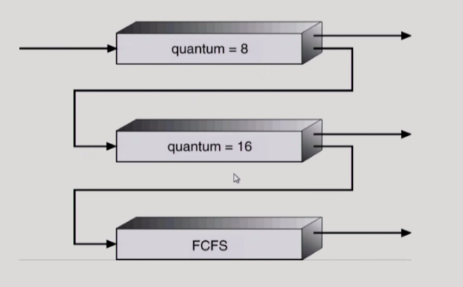

## [CPU 스케쥴링 #1](https://core.ewha.ac.kr/publicview/C0101020140328151311578473?vmode=f)

### CPU and I/O Bursts in Program Execution

- I/O와 CPU의 작업이 반복됨
- CPU를 누구한테 줄 것인가, 맡긴 후 계속 쓰게 할 것인가의 두 가지 고민이 필요함

### CPU-burst Time의 분포

- cpu를 연속적으로 쓰는 시간. 짧은 경우가 빈번함(I/O 가 끼어드는 경우)
- CPU bound job: 짧은 경우 = 사람과 interaction 하는 경우
- 여러 종류의 job(process)이 섞여 있기 때문에 cpu 스케줄링 필요.
- Interactive job에게 적절한 response 제공 요망

### 프로세스의 특성 분류
4장 참고.
- IO-bound process
- CPU-bound process

### CPU Scheduler & Dispatcher

- CPU Scheduler:
- Dispatcher: 
- nonpreemptive(비선점형): cpu 자진반납
- preemptive: 강제로 빼앗기

### 스케쥴링 성능 척도(Scheduling Criteria)

시스템 입장(하나로 일 많이 시키는게 좋음) - 사장
- 이용률: cpu가 일한 시간/전체시간
- 처리량: 주어진 시간 동안 몇 개의 일을 처리했는가
---
프로그램 입장(cpu를 빨리 얻어서 빨리 끝나는게 좋음) - 고객
- Turnaround Time(소요 시간): cpu를 쓰러 들어와서 다 쓰고 나갈 때까지 걸린 시간
  - 시간==cpu관점이기 때문에 프로세스 시작~종료 시간이 아님
- 대기 시간: ready queue에서 기다린 시간의 총 합
- 응답 시간: 처음으로 cpu를 얻기 까지 걸린 시간
  - time sharing환경에선 사용자 응답과 관련해서 중요하기 때문
- 선점형인 경우 응답시간과 대기시간이 다를 수 있다.

### 스케쥴링 알고리즘

- FCFS(First-Come First-Served): 먼저 온 순서대로 처리, 비선점형, 썩 좋은 방법은 아님
  - 먼저 온 프로세스의 길이가 짧으면 Waiting time이 짧아짐
  - Convoy effect: 긴 프로세스 뒤에 짧은 프로세스들이 지나치게 오래 기다려야하는 현상
- SJF(Shortest-Job-First): 각 프로세스의 다음번 CPU burst time을 가지고 스케줄링에 활용
  - Nonpreemptive: 현재 수행중인 프로세스가 cpu 사용
      - 사용 후 나가는 시점에 판단
  - Preemptive: 현재 수행중인 프로세스의 burst time 보다 더 짧은 cpu burst time을 가지는 새로운 프로세스가 도착하면 CPU를 빼앗김
      - SRTF(Shortest-Remaining-Time-First)라고 도 부름
      - 새로운 프로세스 도착 시점에 판단
  - 최소 Average waiting time 보장(SRTF)
  - 문제점
      - Starvation: burst time이 긴 프로세스는 영원히 cpu를 못 받을 수 도 있음
      - cpu 사용시간을 미리 알 수 없음. 과거의 burst time을 이용한 추정만 가능함 (exponential averaging)
- Priority Scheduling: 우선순위가 가장 높은 프로세스에게 CPU 할당, 선점/비선점형이 있음
  - 보통 정수값으로 표현, 대부분 작은 숫자가 우선순위가 높다.
  - 문제: Starvation
  - 해결: Aging - 시간이 지나면 우선순위가 높아지도록 함
- Round Robin (RR): 각 프로세스는 동일한 크기의 할당 시간(time quantum)을 가짐, 선점형
  - 시간이 끝나면 대기 큐의 마지막으로 가서 줄선다.
  - 응답 시간이 빨라짐
  - 어떤 프로세스도 (n-1)q time unit 이상 기다리지 않음
  - q가 너무 작으면 context switch: 오버헤드가 커짐
  - (특이한 경우) 동일한 시간의 프로세스들이 있다면 안좋을 수도 있다. => time quantum을 길게 잡으면 됨

## [CPU 스케쥴링 #2](https://core.ewha.ac.kr/publicview/C0101020140401134252676046?vmode=f)

### 스케쥴링 알고리즘 (복수개)
- multilevel Queue : 공정 X, 차별적임
  

  - Ready queue를 여러 개로 분할
    -  foreground(interactive한 job을 넣음)
    - background(barch-no human interaction 을 넣음)
  - 각 큐는 독립적인 스케줄링 알고리즘을 가짐
   	- foreground => RR
    - background => FCFS
    
  - queue에 대한 스케줄링이 필요
  	- Fixed priority scheduling (=> 우선순위에 따라 엄격하게 우선순위가 높은 큐가 비어야 낮은 큐 실행)
      - serve all from foreground then from background
      - possibility of starvation
    - time slice (=> starvation이 발생하지 않음)
     	- 각 큐에 CPU time을 적절한 비율로 할당
      - Eg., 80% to foreground in RR, 20% to background in FCFS
 
 

- multilevel Feedback Queue
  

	- 프로세스가 다른 큐로 이동 가능
  - 에이징(aging)을 이와 같은 방식으로 구현할 수 있다
  - multilevel-feedback-queue scheduler를 정의하는 파라미터들
    - Queue의 수
    - 각 큐의 scheduling algorithm
    - process를 상위 큐로 보내는 기준
    - process를 하위 큐로 내쫒는 기준
    - 프로세스가 CPU 서비스를 받으려 할 때 들어갈 큐를 결정하는 기준

**=> 여기까지는 CPU가 한개일 때**

**Multiple-Processor Scheduling**
- CPU가 여러 개인 경우 스케줄링은 더욱 복잡해짐
- Homogeneous processor인 경우
	- Queue에 한줄로 세워서 각 프로세서가 알아서 꺼내가게 할 수 있다
  - 반드시 특정 프로세서에서 수행되어야 하는 프로세스가 있는 경우에는 문제가 더 복잡해짐
    
- Load sharing
	- 일부 프로세서에 job이 몰리지 않도록 부하를 적절히 공유하는 메커니즘 필요
  - 별개의 큐를 두는 방법 vs 공동 큐를 사용하는 방법
  
- Symmetric Multiprocessing(SMP)
	- 각 프로세서가 각자 알아서 스케줄링 결정
    
- Asymmetric multiprocessing
	- 하나의 프로세서가 시스템 데이터의 접근과 공유를 책임지고 나머지 프로세서는 거기에 따름

**Real-Time Scheduling**
- Hard real-time system : 정해진 시간 안에 반드시 끝내도록 스케줄링해야함

- Soft real-time system : 일반 프로세스에 비해 높은 priority를 갖도록 해야함

**Thread Scheduling**
- Local Schduling : User level thread의 경우 사용자 수준의 thread library에 의해 어떤 thread를 스케줄할지 결정 => OS가 스케줄하는게 아니라 사용자 프로세스가 직접 어느 thread에 CPU를 줄지 결정. OS는 thread의 존재를 모름

- Global Schedulig : Kernel level thread의 경우 일반 프로세스와 마찬가지로 커널의 단기 스케줄러가 어떤 thread를 스케줄할지 결정
=> OS가 thread의 존재를 앎

### 스케쥴링 알고리즘 평가
**Queuing models (이론적인 방법)**

(server = CPU)
- 확률 분포로 주어지는 arrival rate와 service rate 등을 통해 각종 performance index 값을 계산

**Implementation (구현) & Measurement (성능 측정)**
- **실제 시스템에 알고리즘을 구현**하여 실제 작업(workload)에 대해서 성능을 측정 비교

**Simulation (모의 실험)**
- 알고리즘을 **모의 프로그램**으로 작성 후 trace를 입력으로 하여 결과 비교
(trace: 실제 프로그램을 돌려서 뽑은 input data가 될 수 있음)

